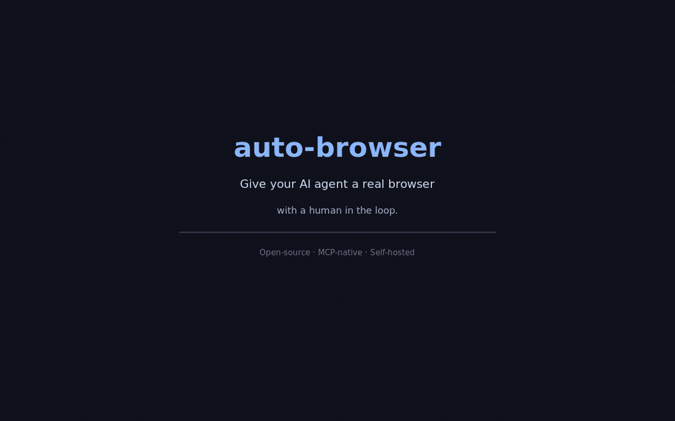
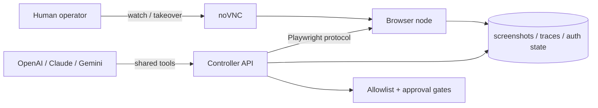

# Auto Browser

[](https://github.com/LvcidPsyche/auto-browser/actions/workflows/ci.yml)
[](./LICENSE)
[](./README.md)
[](./README.md)
[](https://glama.ai/mcp/servers/LvcidPsyche/auto-browser)



> **Give your AI agent a real browser — with a human in the loop.**

Open-source **MCP-native browser agent** for authorized workflows.

Works with:
- Claude Desktop
- Cursor
- any MCP client that can speak JSON-RPC tools
- direct REST callers when you want curl-first control

## Why Auto Browser?

- **MCP-native, not bolted on later.** Use it from Claude Desktop, Cursor, or any MCP client.
- **Human takeover when the web gets weird.** noVNC lets you recover from brittle flows without losing the session.
- **Login once, reuse later.** Save named auth profiles and reopen fresh sessions already signed in.

If you want one clean mental model, this repo is:

> **browser agent as an MCP server**

If Auto Browser is useful, a ⭐ helps others find it.

## 3-command quickstart

```bash
git clone https://github.com/LvcidPsyche/auto-browser.git
cd auto-browser
docker compose up --build
```

That works with **zero config for local dev**.

Optional sanity check:

```bash
make doctor
```

Open:
- API docs: `http://localhost:8000/docs`
- Operator Dashboard: `http://localhost:8000/ui/`
- Visual takeover: `http://localhost:6080/vnc.html?autoconnect=true&resize=scale`

All published ports bind to `127.0.0.1` by default.

Only copy `.env.example` if you want to change ports, providers, or allowed hosts:

```bash
cp .env.example .env
```

To see the rest of the common commands:

```bash
make help
```

## What’s new in v0.5.0

- **CDP Connect Mode** — attach to an existing Chrome via `--remote-debugging-port` instead of launching a new one
- **Network Inspector** — per-session request/response capture with header masking and PII scrubbing
- **PII Scrubbing Layer** — 16 pattern classes (AWS keys, JWTs, credit cards, SSNs, emails…); pixel redaction on screenshots; console + network body scrubbing
- **Proxy Partitioning** — named proxy personas for per-agent static IPs, preventing shared network footprints
- **Shadow Browsing** — flip a headless session to a headed (visible) browser mid-run for live debugging
- **Session Forking** — branch a session’s auth state (cookies + storage) into a new independent session
- **Playwright Script Export** — `GET /sessions/{id}/export-script` downloads the session as runnable Python
- **Shared Session Links** — HMAC-signed, TTL-enforced observer tokens for team handoffs
- **Vision-Grounded Targeting** — `browser.find_by_vision` uses Claude Vision to locate elements by natural language description
- **Cron + Webhook Triggers** — APScheduler-backed autonomous jobs; HMAC webhook keys; full CRUD at `/crons`
- **MCP Resources Protocol** — `resources/list` + `resources/read` expose live screenshot, DOM, console, and network log as MCP resources
- **30+ new MCP tools** — eval_js, get_html, find_elements, drag_drop, set_viewport, cookies/storage R/W, and more

See [CHANGELOG.md](./CHANGELOG.md) for the full list.

## What’s included

- a **browser node** with Chromium, Xvfb, x11vnc, and noVNC
- a **controller API** built on FastAPI + Playwright
- **screen-aware observations** with screenshots and interactable element IDs
- optional **OCR excerpts** from screenshots via Tesseract
- **human takeover** through noVNC
- **artifact capture** for screenshots, traces, and storage state
- optional **encrypted auth-state storage** with max-age enforcement on restore
- reusable **named auth profiles** for login-once, reuse-later workflows
- **basic policy rails** with host allowlists and upload approval gates
- **durable session metadata** under `/data/sessions`, with optional Redis backing
- **durable agent job records** under `/data/jobs` with background workers for queued step/run requests
- **audit events** with per-request operator identity headers
- optional **SQLite backing** for approvals + audit events
- optional built-in REST agent runner for **OpenAI, Claude, and Gemini**
- one-step and multi-step **REST agent orchestration endpoints**
- richer browser abilities through the shared action schema: **hover, select_option, wait, reload, back, forward**
- **tab awareness and tab controls** for popup-heavy workflows
- **download capture** with session-scoped files and URLs under `/artifacts`
- optional **session-level proxy routing** and custom user agents for controlled network paths
- **social page helpers** for feed scrolling, post/profile extraction, search, and approval-gated write actions
- a browser-node managed **Playwright server endpoint** so the controller connects over Playwright protocol instead of CDP
- optional **docker-ephemeral per-session browser isolation** with dedicated noVNC ports
- a **real MCP JSON-RPC transport** at `/mcp`, plus convenience endpoints at `/mcp/tools` + `/mcp/tools/call`
- **CDP connect mode** — attach to an existing Chrome instance instead of launching a new one
- **network inspector** — per-session request/response capture with PII scrubbing and header masking
- **PII scrubbing layer** — 16 pattern classes with Pillow pixel redaction on screenshots
- **proxy partitioning** — named proxy personas for per-agent static IP assignment
- **shadow browsing** — flip headless → headed mid-run for live visual debugging
- **session forking** — clone auth state into a new independent session branch
- **Playwright script export** — download any session as a runnable `.py` file
- **shared session links** — HMAC-signed, TTL-bound observer tokens
- **vision-grounded targeting** — Claude Vision locates elements by natural language
- **cron + webhook triggers** — autonomous scheduled browser jobs via APScheduler
- **MCP Resources Protocol** — live screenshot, DOM, console, network as `browser://` resources
- **30+ MCP tools** — `eval_js`, `get_html`, `find_elements`, `drag_drop`, cookies/storage R/W, and more

It is intentionally **not** a stealth or anti-bot system. It is for operator-assisted browser workflows on sites and accounts you are authorized to use.

## Good fits

- internal dashboards and admin tools
- agent-assisted QA and browser debugging
- login-once, reuse-later account workflows
- export/download/report flows
- brittle sites where a human may need to step in
- MCP-powered agent workflows that need a real browser

## Not the goal

- anti-bot bypass
- CAPTCHA solving
- stealth/evasion work
- unauthorized scraping or account automation

## Architecture at a glance



See:
- `docs/architecture.md` for the full design
- `docs/llm-adapters.md` for the model-facing action loop
- `docs/mcp-clients.md` for MCP client integration notes
- `docs/production-hardening.md` for the production target/spec
- `docs/deployment.md` for the deployment and credential handoff checklist
- `docs/good-first-issues.md` for contributor-friendly starter work
- `examples/README.md` for curl-first examples
- `ROADMAP.md` for project direction
- `CODE_OF_CONDUCT.md` for community expectations
- `CONTRIBUTING.md` if you want to help

## Quick demo flow

The fastest way to understand the project:

1. create a session
2. observe the page
3. take over visually if needed
4. save an auth profile
5. reopen a new session from that saved profile

That flow is what makes the project actually useful in day-to-day work.

If you want the shortest copy-paste curl walkthrough for that pattern, start with:

- `examples/login-and-save-profile.md`

## Real demo flow

The simplest high-signal demo for this project is:

1. log into Outlook once
2. save the browser state as `outlook-default`
3. open a fresh session from `auth_profile: "outlook-default"`
4. continue work without reauthing

That is the clearest example of why this is more useful than plain browser automation.

## MCP usage

Auto Browser exposes a real MCP transport at:

```text
/mcp
```

It also exposes convenience tool endpoints at:

```text
/mcp/tools
/mcp/tools/call
```

That means you can use it as:
- a local browser tool server for MCP clients
- a supervised browser backend for agent frameworks
- a plain REST API if you want to script it directly

The differentiator is not just “browser automation.”
The differentiator is **a browser agent that is already packaged as an MCP server**.

### MCP transport modes

- **HTTP MCP server** at `http://127.0.0.1:8000/mcp`
- **stdio bridge** at `scripts/mcp_stdio_bridge.py`

Most MCP clients still default to stdio. Auto Browser now ships the bridge out of the box, so you do not need a separate compatibility layer.

### Claude Desktop quickstart

Copy `examples/claude_desktop_config.json` and replace `<ABSOLUTE_PATH_TO_AUTO_BROWSER>` with your real clone path:

```json
{
  "mcpServers": {
    "auto-browser": {
      "command": "python3",
      "args": [
        "<ABSOLUTE_PATH_TO_AUTO_BROWSER>/scripts/mcp_stdio_bridge.py"
      ],
      "env": {
        "AUTO_BROWSER_BASE_URL": "http://127.0.0.1:8000/mcp",
        "AUTO_BROWSER_BEARER_TOKEN": ""
      }
    }
  }
}
```

Then:

1. start Auto Browser with `docker compose up --build`
2. optional manual bridge command: `make stdio-bridge`
3. paste that config into Claude Desktop
4. restart Claude Desktop
5. use the `auto-browser` MCP server through stdio

### Tool surface

The default MCP tool profile exposes **32 tools** covering:

- session lifecycle, navigation, observation
- click, type, hover, scroll, select, drag-drop, eval JS
- screenshot, DOM access, cookies, local/session storage
- network log inspection, console log access
- auth profiles, proxy personas, session forking
- vision-grounded element targeting
- cron job management, shared session links
- Playwright script export, shadow browsing

Internal queue/provider/admin tools are hidden by default.

If you want the entire internal tool surface, set:

```bash
MCP_TOOL_PROFILE=full
```

## Why this is free

Auto Browser is designed to be free to use because it is:

- open-source
- self-hosted
- local-first
- bring-your-own browser/runtime
- bring-your-own model/provider

There is no required hosted control plane in the core project.

### One-command readiness check

For a quick VPS sanity check before a live session:

```bash
make doctor
```

For a fuller pre-release pass that validates docs, compose config, tests, and the live smoke:

```bash
make release-audit
```

That script:
- picks alternate local ports automatically if `8000`, `6080`, or `5900` are already occupied
- waits for `/readyz`
- prints provider readiness
- runs a real create-session + observe smoke
- runs one agent-step smoke when the chosen provider is configured
- loads the repo-local `.env` so ambient shell secrets do not accidentally override tonight's config

If you also want it to rebuild the images first:

```bash
DOCTOR_BUILD=1 make doctor
```

If you are using `OPENAI_AUTH_MODE=host_bridge`, make sure the Codex bridge is already running first.

If you want the controller API itself protected, set `API_BEARER_TOKEN` and send:

```bash
Authorization: Bearer <token>
```

Optional operator headers:

```bash
X-Operator-Id: alice
X-Operator-Name: Alice Example
```

Set `REQUIRE_OPERATOR_ID=true` if every non-health request must carry an operator ID.

### Production-mode minimums

For a real private beta, set at least:

```bash
APP_ENV=production
API_BEARER_TOKEN=<strong-random-secret>
REQUIRE_OPERATOR_ID=true
AUTH_STATE_ENCRYPTION_KEY=<44-char-fernet-key>
REQUIRE_AUTH_STATE_ENCRYPTION=true
REQUEST_RATE_LIMIT_ENABLED=true
METRICS_ENABLED=true
```

The controller now fails closed on startup in production mode if the required security settings are missing.

### Provider auth modes

By default the controller talks to vendor APIs directly with API keys.

If you already use subscription-backed CLIs instead, Auto Browser can route provider decisions through:

- `codex` for OpenAI
- `claude` for Anthropic / Claude Code
- `gemini` for Gemini CLI

Set the auth modes explicitly:

```bash
OPENAI_AUTH_MODE=cli
CLAUDE_AUTH_MODE=cli
GEMINI_AUTH_MODE=cli
CLI_HOME=/data/cli-home
```

Then populate `data/cli-home` with the auth caches from the machine where those CLIs are already signed in:

```bash
mkdir -p data/cli-home
rsync -a ~/.codex data/cli-home/.codex
cp ~/.claude.json data/cli-home/.claude.json
rsync -a ~/.claude data/cli-home/.claude
rsync -a ~/.gemini data/cli-home/.gemini
```

If you just want to sign in interactively on this host, use the included bootstrap helper instead. It is meant for the default writable `/data/...` auth-cache flow and opens the CLI inside the controller image with `HOME=$CLI_HOME` (normally `/data/cli-home`), so the login state lands exactly where Auto Browser expects it:

```bash
./scripts/bootstrap_cli_auth.sh codex
./scripts/bootstrap_cli_auth.sh claude
./scripts/bootstrap_cli_auth.sh gemini
# or
./scripts/bootstrap_cli_auth.sh all
```

If this box already has those subscription logins locally, the smoother path is to mount the real host homes read-only at their native paths instead of copying caches around:

```bash
CLI_HOST_HOME=/home/youruser \
OPENAI_AUTH_MODE=cli \
CLAUDE_AUTH_MODE=cli \
GEMINI_AUTH_MODE=cli \
docker compose -f docker-compose.yml -f docker-compose.host-subscriptions.yml up --build
```

That override:
- mounts `~/.codex`, `~/.claude`, `~/.claude.json`, and `~/.gemini` read-only
- sets `CLI_HOME` to the host-style home path inside the container
- behaves much more like running the CLIs directly on the host

If your host home is not `/home/youruser`, set `CLI_HOST_HOME` first. Do not use `bootstrap_cli_auth.sh` in this mode; sign in on the host first and then start the override.

If Codex subscription auth still does not survive inside Docker cleanly, use the host-side bridge instead. It runs `codex` on the host and exposes a Unix socket through the shared `./data` mount:

```bash
mkdir -p data/host-bridge
python3 scripts/codex_host_bridge.py --socket-path data/host-bridge/codex.sock
```

If you want it to behave more like a persistent host skill, install the included user-service template once:

```bash
mkdir -p ~/.config/systemd/user
cp ops/systemd/codex-host-bridge.service ~/.config/systemd/user/
systemctl --user daemon-reload
systemctl --user enable --now codex-host-bridge.service
```

Then start the controller with:

```bash
OPENAI_AUTH_MODE=host_bridge \
OPENAI_HOST_BRIDGE_SOCKET=/data/host-bridge/codex.sock \
docker compose up --build
```

That gives OpenAI/Codex the closest behavior to a host-side skill, because the actual CLI stays on the host instead of inside the container.

Notes:
- the bridge socket is now health-checked, not just path-checked
- host codex requests are killed after 55s by default so the bridge does not leak orphaned CLI jobs
- the bridge is a **local trust boundary**: anyone who can talk to that Unix socket can make the host run `codex exec`
- keep `data/host-bridge` private to trusted local users/processes only
- keep `data/cli-home` private; it contains live auth material
- API keys are still the better default for CI/public automation
- CLI auth is aimed at trusted single-tenant boxes like your VPS + Tailscale setup

If you want **true per-session browser isolation**, use the compose override:

```bash
docker compose -f docker-compose.yml -f docker-compose.isolation.yml up --build
```

That keeps the default shared browser-node available, but new sessions are provisioned as one-off browser containers with their own noVNC ports when `SESSION_ISOLATION_MODE=docker_ephemeral`.
Raise `MAX_SESSIONS` above `1` if you want multiple isolated sessions live at once.
The existing reverse-SSH sidecar still only tunnels the controller API plus the shared browser-node noVNC port.
If isolated session noVNC ports are only bound locally, enable the controller-managed `ISOLATED_TUNNEL_*` settings to open a reverse-SSH tunnel per session.
If you already have direct host reachability, set `ISOLATED_TAKEOVER_HOST` to a host humans can actually reach and skip the extra tunnel broker.
When the controller brokers an isolated-session tunnel, it targets the per-session browser container over the Docker network by default instead of hairpinning back through a host-published port.

For remote access, you now have two sane paths:
- put the stack behind **Tailscale / Cloudflare Access**
- run the optional **reverse-SSH sidecar** and point `TAKEOVER_URL` at the forwarded noVNC URL

If `8000`, `6080`, or `5900` are already taken on the host, override them inline:

```bash
API_PORT=8010 NOVNC_PORT=6081 VNC_PORT=5901 \
TAKEOVER_URL='http://127.0.0.1:6081/vnc.html?autoconnect=true&resize=scale' \
docker compose up --build
```

### Shared action schema and download API

Beyond the convenience routes (`/actions/click`, `/actions/type`, etc.), the controller now exposes:

- `POST /sessions/{session_id}/actions/execute`
  - accepts the full shared `BrowserActionDecision` schema
  - supports `hover`, `select_option`, `wait`, `reload`, `go_back`, and `go_forward`
- `GET /sessions/{session_id}/tabs`
  - lists the currently open pages in the session
- `POST /sessions/{session_id}/tabs/activate`
  - makes a tab the primary page for future observations/actions
- `POST /sessions/{session_id}/tabs/close`
  - closes a tab by index and rebinds the session to the active tab
- `GET /sessions/{session_id}/downloads`
  - lists files captured for that session
  - download files are saved under the session artifact tree and served from `/artifacts/...`

### Reverse SSH remote access

This repo now includes an optional `reverse-ssh` profile that forwards:
- controller API `8000` -> remote port `REVERSE_SSH_REMOTE_API_PORT`
- noVNC `6080` -> remote port `REVERSE_SSH_REMOTE_NOVNC_PORT`

Setup:

```bash
mkdir -p data/ssh data/tunnels
chmod 700 data/ssh
cp ~/.ssh/id_ed25519 data/ssh/id_ed25519
chmod 600 data/ssh/id_ed25519
ssh-keyscan -p 22 bastion.example.com > data/ssh/known_hosts
```

Then set these in `.env`:

```bash
REVERSE_SSH_HOST=bastion.example.com
REVERSE_SSH_USER=browserbot
REVERSE_SSH_PORT=22
REVERSE_SSH_REMOTE_BIND_ADDRESS=127.0.0.1
REVERSE_SSH_REMOTE_API_PORT=18000
REVERSE_SSH_REMOTE_NOVNC_PORT=16080
REVERSE_SSH_ACCESS_MODE=private
TAKEOVER_URL=http://bastion.example.com:16080/vnc.html?autoconnect=true&resize=scale
```

Start it:

```bash
docker compose --profile reverse-ssh up --build
```

Notes:
- default remote bind is `127.0.0.1` on the SSH server. That is safer.
- the sidecar refuses non-local reverse binds unless `REVERSE_SSH_ALLOW_NONLOCAL_BIND=true`.
- `REVERSE_SSH_ACCESS_MODE=private` is the default. That means bastion-only unless you front it with Tailscale or Cloudflare Access.
- `REVERSE_SSH_ACCESS_MODE=cloudflare-access` expects `REVERSE_SSH_PUBLIC_SCHEME=https`.
- non-local reverse binds are only allowed in `REVERSE_SSH_ACCESS_MODE=unsafe-public`. That is intentionally loud because `GatewayPorts` exposure is easy to get wrong.
- the sidecar writes connection metadata to `data/tunnels/reverse-ssh.json`.
- the sidecar refreshes that metadata on a heartbeat, and the controller marks stale tunnel metadata as inactive.

### Run the local reverse-SSH smoke test

This repo includes a self-contained smoke harness with a disposable SSH bastion container:

```bash
./scripts/smoke_reverse_ssh.sh
```

If `8000` is busy on the host, run the smoke with an override like `API_PORT=8010 ./scripts/smoke_reverse_ssh.sh`.

It verifies:
- controller `/remote-access`
- forwarded API through the bastion
- forwarded noVNC through the bastion
- session create + observe through the forwarded API

### Run the local isolated-session smoke test

This repo also includes a smoke harness for per-session docker isolation:

```bash
./scripts/smoke_isolated_session.sh
```

If the default controller port is busy, run `API_PORT=8010 ./scripts/smoke_isolated_session.sh`.

It verifies:
- controller readiness with the isolation override enabled
- session create in `docker_ephemeral` mode
- dedicated per-session noVNC port wiring
- session-scoped `remote_access` metadata
- observe + close flow
- isolated browser container cleanup after close

### Run the local isolated-session tunnel smoke test

This repo also includes a smoke harness for controller-managed reverse tunnels on isolated session takeover ports:

```bash
./scripts/smoke_isolated_session_tunnel.sh
```

If the default controller port is busy, run `API_PORT=8010 ./scripts/smoke_isolated_session_tunnel.sh`.

It verifies:
- controller-managed isolated session tunnel provisioning against the disposable bastion
- session-specific remote-access payloads flipping to `active`
- remote noVNC reachability from the bastion on the assigned per-session port
- isolated tunnel teardown on session close

### Check configured model providers

```bash
curl -s http://localhost:8000/agent/providers | jq
```

Each provider entry reports:
- `configured`
- `auth_mode` (`api` or `cli`)
- `model`
- `detail` with the concrete readiness reason or missing prerequisite

### Inspect active remote-access metadata

```bash
curl -s http://localhost:8000/remote-access | jq
curl -s 'http://localhost:8000/remote-access?session_id=<session-id>' | jq
```

If the reverse-SSH sidecar is running, observations and session summaries will automatically return the forwarded `takeover_url` from `data/tunnels/reverse-ssh.json`.
For isolated sessions, the `remote_access` payload becomes session-specific so you can see whether that session’s own noVNC URL is still local-only, directly reachable, or being served through a controller-managed session tunnel.

### Create a session

```bash
curl -s http://localhost:8000/sessions \
  -X POST \
  -H 'content-type: application/json' \
  -d '{"name":"demo","start_url":"https://example.com"}' | jq
```

### Observe the page

```bash
curl -s http://localhost:8000/sessions/<session-id>/observe | jq
```

The response includes:
- current URL and title
- a page-level `text_excerpt`
- a compact `dom_outline` with headings, forms, and element counts
- an `accessibility_outline` distilled from Playwright’s accessibility tree
- an `ocr` payload with screenshot text excerpts and bounding boxes
- a screenshot path and artifact URL
- interactable elements with observation-scoped `element_id` values
- recent console errors
- the effective noVNC takeover URL
- remote-access metadata when a tunnel sidecar is active
- explicit isolation metadata, including per-session auth/upload roots and the shared-browser-node limit

### Click by `element_id`

```bash
curl -s http://localhost:8000/sessions/<session-id>/actions/click \
  -X POST \
  -H 'content-type: application/json' \
  -d '{"element_id":"op-abc123"}' | jq
```

### Type into an input

```bash
curl -s http://localhost:8000/sessions/<session-id>/actions/type \
  -X POST \
  -H 'content-type: application/json' \
  -d '{"selector":"input[name=q]","text":"playwright mcp","clear_first":true}' | jq
```

For secrets, set `sensitive=true` so action logs redact the typed preview:

```bash
curl -s http://localhost:8000/sessions/<session-id>/actions/type \
  -X POST \
  -H 'content-type: application/json' \
  -d '{"selector":"input[type=password]","text":"super-secret","clear_first":true,"sensitive":true}' | jq
```

For passwords, OTPs, or other secrets, set `sensitive: true` so action logs redact the typed value preview:

```bash
curl -s http://localhost:8000/sessions/<session-id>/actions/type \
  -X POST \
  -H 'content-type: application/json' \
  -d '{"element_id":"op-password","text":"super-secret","clear_first":true,"sensitive":true}' | jq
```

### Hover over an element

```bash
curl -s http://localhost:8000/sessions/<session-id>/actions/hover \
  -X POST \
  -H 'content-type: application/json' \
  -d '{"selector":"#dropdown-trigger"}' | jq
```

Use coordinates instead: `{"x": 640, "y": 360}`

### Select a dropdown option

```bash
curl -s http://localhost:8000/sessions/<session-id>/actions/select-option \
  -X POST \
  -H 'content-type: application/json' \
  -d '{"selector":"select#size","value":"large"}' | jq
```

Also accepts `label` (visible text) or `index` (0-based position).

### Wait, reload, and navigate history

```bash
# Wait 1.5 seconds
curl -s http://localhost:8000/sessions/<session-id>/actions/wait \
  -X POST -H 'content-type: application/json' -d '{"wait_ms":1500}' | jq

# Reload the current page
curl -s http://localhost:8000/sessions/<session-id>/actions/reload \
  -X POST | jq

# Browser back / forward
curl -s http://localhost:8000/sessions/<session-id>/actions/go-back  -X POST | jq
curl -s http://localhost:8000/sessions/<session-id>/actions/go-forward -X POST | jq
```

### Save auth state for later reuse

```bash
curl -s http://localhost:8000/sessions/<session-id>/storage-state \
  -X POST \
  -H 'content-type: application/json' \
  -d '{"path":"demo-auth.json"}' | jq
```

That path is now saved under the session’s own auth root:

```text
/data/auth/<session-id>/demo-auth.json
```

If `AUTH_STATE_ENCRYPTION_KEY` is set, the controller saves:

```text
/data/auth/<session-id>/demo-auth.json.enc
```

Restores enforce `AUTH_STATE_MAX_AGE_HOURS`, so stale auth-state files are rejected instead of silently reused.

Inspect the current auth-state metadata:

```bash
curl -s http://localhost:8000/sessions/<session-id>/auth-state | jq
```

### Save a reusable auth profile

Auth profiles live under `/data/auth/profiles/<profile-name>/` and are not cleaned up by routine retention jobs.

```bash
curl -s http://localhost:8000/sessions/<session-id>/auth-profiles \
  -X POST \
  -H 'content-type: application/json' \
  -d '{"profile_name":"outlook-default"}' | jq
```

List saved profiles:

```bash
curl -s http://localhost:8000/auth-profiles | jq
curl -s http://localhost:8000/auth-profiles/outlook-default | jq
```

Start a new session from a saved profile:

```bash
curl -s http://localhost:8000/sessions \
  -X POST \
  -H 'content-type: application/json' \
  -d '{"name":"outlook-resume","auth_profile":"outlook-default","start_url":"https://outlook.live.com/mail/0/"}' | jq
```

### Outlook login + save workflow

This is the simplest pattern for “human login once, then reuse later”.

```bash
curl -s http://localhost:8000/sessions \
  -X POST \
  -H 'content-type: application/json' \
  -d '{"name":"outlook-login","start_url":"https://login.live.com/"}' | jq
```

Then log in and save the profile in one step:

```bash
curl -s http://localhost:8000/sessions/<session-id>/social/login \
  -X POST \
  -H 'content-type: application/json' \
  -d '{
    "platform":"outlook",
    "username":"you@example.com",
    "password":"REDACTED",
    "auth_profile":"outlook-default"
  }' | jq
```

If Microsoft throws a human verification wall, use the returned `takeover_url`, finish the challenge manually in noVNC, then save the profile:

```bash
curl -s http://localhost:8000/sessions/<session-id>/auth-profiles \
  -X POST \
  -H 'content-type: application/json' \
  -d '{"profile_name":"outlook-default"}' | jq
```

### Save a reusable auth profile

Per-session auth-state files are good for debugging. Named auth profiles are better for repeat runs.

Save the current browser context as a reusable profile:

```bash
curl -s http://localhost:8000/sessions/<session-id>/auth-profiles \
  -X POST \
  -H 'content-type: application/json' \
  -d '{"profile_name":"outlook-default"}' | jq
```

List saved profiles:

```bash
curl -s http://localhost:8000/auth-profiles | jq
```

Start a new session from a saved profile:

```bash
curl -s http://localhost:8000/sessions \
  -X POST \
  -H 'content-type: application/json' \
  -d '{"name":"outlook-mail","start_url":"https://outlook.live.com/mail/0/","auth_profile":"outlook-default"}' | jq
```

Saved auth profiles live under:

```text
/data/auth/profiles/<profile-name>/
```

The maintenance cleaner treats `/data/auth/profiles` as persistent state, so reusable profiles are not pruned like stale session artifacts.

### Outlook login + save-session workflow

If you already own the mailbox and just need a reusable logged-in session:

1. Create a session at `https://login.live.com/`
2. Run `POST /sessions/<id>/social/login` with:
   - `"platform": "outlook"`
   - `"username": "<mailbox>"`
   - `"password": "<password>"`
   - optional `"auth_profile": "outlook-default"`
3. If Microsoft shows CAPTCHA or “press and hold”, switch to the session `takeover_url`
4. When login completes, reuse the saved auth profile in future sessions

Example:

```bash
curl -s http://localhost:8000/sessions/<session-id>/social/login \
  -X POST \
  -H 'content-type: application/json' \
  -d '{"platform":"outlook","username":"you@outlook.com","password":"...","auth_profile":"outlook-default"}' | jq
```

### Stage upload files

This POC expects upload files to be staged on disk first:

```bash
cp ~/Downloads/example.pdf data/uploads/
```

For cleaner isolation, you can also stage per-session files under:

```text
data/uploads/<session-id>/
```

Then request and execute approval through the queue:

```bash
curl -s http://localhost:8000/sessions/<session-id>/actions/upload \
  -X POST \
  -H 'content-type: application/json' \
  -d '{"selector":"input[type=file]","file_path":"example.pdf"}' | jq
```

That returns `409` with a pending approval payload. Then:

```bash
curl -s http://localhost:8000/approvals/<approval-id>/approve \
  -X POST \
  -H 'content-type: application/json' \
  -d '{"comment":"approved"}' | jq

curl -s http://localhost:8000/approvals/<approval-id>/execute \
  -X POST | jq
```

### Inspect approvals

```bash
curl -s http://localhost:8000/approvals | jq
curl -s http://localhost:8000/approvals/<approval-id> | jq
```

### Ask a provider for one next step

```bash
curl -s http://localhost:8000/sessions/<session-id>/agent/step \
  -X POST \
  -H 'content-type: application/json' \
  -d '{
    "provider":"openai",
    "goal":"Open the main link on the page and stop.",
    "observation_limit":25
  }' | jq
```

### Let a provider run a short loop

```bash
curl -s http://localhost:8000/sessions/<session-id>/agent/run \
  -X POST \
  -H 'content-type: application/json' \
  -d '{
    "provider":"claude",
    "goal":"Fill the search field with playwright mcp and stop before submitting.",
    "max_steps":4
  }' | jq
```

If a model proposes an upload, post/send, payment, account change, or destructive step, the run now stops with `status=approval_required` and writes a queued approval item instead of executing the side effect.

### Queue agent work for background execution

```bash
curl -s http://localhost:8000/sessions/<session-id>/agent/jobs/step \
  -X POST \
  -H 'content-type: application/json' \
  -d '{
    "provider":"openai",
    "goal":"Inspect the page and stop."
  }' | jq

curl -s http://localhost:8000/sessions/<session-id>/agent/jobs/run \
  -X POST \
  -H 'content-type: application/json' \
  -d '{
    "provider":"claude",
    "goal":"Open the first result and summarize it.",
    "max_steps":4
  }' | jq

curl -s http://localhost:8000/agent/jobs | jq
curl -s http://localhost:8000/agent/jobs/<job-id> | jq
```

Queued jobs are persisted under `/data/jobs`. If the controller restarts mid-run, any previously `running` jobs are marked `interrupted` on startup instead of disappearing.

### Audit trail and operator identity

```bash
curl -s http://localhost:8000/operator | jq
curl -s 'http://localhost:8000/audit/events?limit=20' | jq
curl -s 'http://localhost:8000/audit/events?session_id=<session-id>' | jq
```

Audit events are written to `/data/audit/events.jsonl`.

If `STATE_DB_PATH` is set, approvals and audit events are also stored in SQLite and served from there. `AUDIT_MAX_EVENTS` caps retained audit rows/events in both SQLite and the mirrored JSONL file.

### Metrics and cleanup

```bash
curl -s http://localhost:8000/metrics | head
curl -s http://localhost:8000/maintenance/status | jq

curl -s http://localhost:8000/maintenance/cleanup \
  -X POST \
  -H "Authorization: Bearer <token>" \
  -H "X-Operator-Id: ops" | jq
```

The controller can now:
- expose Prometheus-style request/session metrics at `/metrics`
- prune stale artifacts, uploads, and auth-state files on startup and on a configurable interval

If `METRICS_ENABLED=false`, `/metrics` returns `404`.

### MCP browser gateway

Convenience endpoints still exist:

```bash
curl -s http://localhost:8000/mcp/tools | jq

curl -s http://localhost:8000/mcp/tools/call \
  -X POST \
  -H 'content-type: application/json' \
  -d '{
    "name":"browser.observe",
    "arguments":{"session_id":"<session-id>","limit":20}
  }' | jq
```

The controller now also exposes a real MCP-style JSON-RPC session transport at `/mcp`:

```bash
INIT=$(curl -si http://localhost:8000/mcp \
  -X POST \
  -H 'content-type: application/json' \
  -d '{
    "jsonrpc":"2.0",
    "id":1,
    "method":"initialize",
    "params":{
      "protocolVersion":"2025-11-25",
      "clientInfo":{"name":"demo-client","version":"0.1.0"},
      "capabilities":{}
    }
  }')

SESSION_ID=$(printf "%s" "$INIT" | awk -F": " '/^MCP-Session-Id:/ {print $2}' | tr -d '\r')

curl -s http://localhost:8000/mcp \
  -X POST \
  -H "content-type: application/json" \
  -H "MCP-Session-Id: $SESSION_ID" \
  -H "MCP-Protocol-Version: 2025-11-25" \
  -d '{"jsonrpc":"2.0","method":"notifications/initialized","params":{}}'

curl -s http://localhost:8000/mcp \
  -X POST \
  -H "content-type: application/json" \
  -H "MCP-Session-Id: $SESSION_ID" \
  -H "MCP-Protocol-Version: 2025-11-25" \
  -d '{"jsonrpc":"2.0","id":2,"method":"tools/list","params":{}}' | jq
```

Notes:
- this transport supports `initialize`, `notifications/initialized`, `ping`, `tools/list`, `tools/call`, and `DELETE /mcp` session teardown
- JSON-RPC batching is intentionally rejected
- if a browser client sends an `Origin` header, set `MCP_ALLOWED_ORIGINS` to the exact allowed origins

## Project layout

```text
auto-browser/
├── browser-node/        # headed Chromium + noVNC image
├── controller/          # FastAPI + Playwright control plane
├── data/                # artifacts, uploads, auth state, durable session/job records, profile data
├── reverse-ssh/         # optional autossh sidecar for private remote access
├── docker-compose.yml
├── docker-compose.isolation.yml
└── docs/
    ├── architecture.md
    └── llm-adapters.md
```

## Opinionated defaults

- Keep **Playwright** as the execution engine.
- Use **screenshots + DOM/interactable metadata** together.
- Use **noVNC/xpra-style takeover** when a flow gets brittle.
- Use **one session per account/workflow**.
- Never automate with your daily browser profile.
- Keep **one active session per browser node** in this POC because takeover is tied to one visible desktop.
- If you need parallel sessions, switch to `docker_ephemeral` isolation so each live session gets its own browser container and takeover port.
- Keep a durable session registry even in the POC so restarts downgrade active sessions to **interrupted** instead of losing them.
- Treat each session’s auth/upload roots as isolated working state even though the visible desktop is still shared.
- Encrypt auth-state at rest once you move beyond localhost demos.
- Require operator IDs once more than one human or worker touches the system.

## Production upgrades after the POC

- replace raw local ports with **Tailscale**, Cloudflare Access, or a hardened bastion
- move session metadata from file/Redis into a richer Postgres model if you need querying and joins
- promote the docker-ephemeral path into **one browser pod per account** once you want scheduler-level isolation
- persist approvals in a database instead of flat files when the POC grows
- add per-operator identity / SSO on top of the approval queue
- add SSE streaming on top of the current MCP JSON-RPC transport if you need server-pushed events

## References

- OpenAI Computer Use: `https://developers.openai.com/api/docs/guides/tools-computer-use/`
- Playwright Trace Viewer: `https://playwright.dev/docs/trace-viewer`
- Playwright BrowserType `connect`: `https://playwright.dev/docs/api/class-browsertype`
- Chrome for Testing: `https://developer.chrome.com/blog/chrome-for-testing`
- noVNC embedding: `https://novnc.com/noVNC/docs/EMBEDDING.html`

## Provider environment variables

Set one or more providers before starting the stack:

- API mode: `OPENAI_API_KEY`, `ANTHROPIC_API_KEY`, `GEMINI_API_KEY`
- CLI mode: `OPENAI_AUTH_MODE=cli`, `CLAUDE_AUTH_MODE=cli`, `GEMINI_AUTH_MODE=cli`

The controller exposes provider readiness at `GET /agent/providers`.

Optional provider resilience knobs:
- `MODEL_MAX_RETRIES`
- `MODEL_RETRY_BACKOFF_SECONDS`

Optional durable session-store knobs:
- `SESSION_STORE_ROOT`
- `REDIS_URL`
- `SESSION_STORE_REDIS_PREFIX`

Optional auth/audit/operator knobs:
- `AUDIT_ROOT`
- `STATE_DB_PATH`
- `AUDIT_MAX_EVENTS`
- `MCP_ALLOWED_ORIGINS`
- `SESSION_ISOLATION_MODE`
- `ISOLATED_BROWSER_IMAGE`
- `ISOLATED_BROWSER_CONTAINER_PREFIX`
- `ISOLATED_BROWSER_WAIT_TIMEOUT_SECONDS`
- `ISOLATED_BROWSER_KEEP_CONTAINERS`
- `ISOLATED_BROWSER_BIND_HOST`
- `ISOLATED_TAKEOVER_HOST`
- `ISOLATED_TAKEOVER_SCHEME`
- `ISOLATED_TAKEOVER_PATH`
- `ISOLATED_BROWSER_NETWORK`
- `ISOLATED_HOST_DATA_ROOT`
- `ISOLATED_DOCKER_HOST`
- `ISOLATED_TUNNEL_ENABLED`
- `ISOLATED_TUNNEL_HOST`
- `ISOLATED_TUNNEL_PORT`
- `ISOLATED_TUNNEL_USER`
- `ISOLATED_TUNNEL_KEY_PATH`
- `ISOLATED_TUNNEL_KNOWN_HOSTS_PATH`
- `ISOLATED_TUNNEL_STRICT_HOST_KEY_CHECKING`
- `ISOLATED_TUNNEL_REMOTE_BIND_ADDRESS`
- `ISOLATED_TUNNEL_REMOTE_PORT_START`
- `ISOLATED_TUNNEL_REMOTE_PORT_END`
- `ISOLATED_TUNNEL_SERVER_ALIVE_INTERVAL`
- `ISOLATED_TUNNEL_SERVER_ALIVE_COUNT_MAX`
- `ISOLATED_TUNNEL_INFO_INTERVAL_SECONDS`
- `ISOLATED_TUNNEL_STARTUP_GRACE_SECONDS`
- `ISOLATED_TUNNEL_ACCESS_MODE`
- `ISOLATED_TUNNEL_PUBLIC_HOST`
- `ISOLATED_TUNNEL_PUBLIC_SCHEME`
- `ISOLATED_TUNNEL_LOCAL_HOST`
- `ISOLATED_TUNNEL_INFO_ROOT`
- `AUTH_STATE_ENCRYPTION_KEY`
- `REQUIRE_AUTH_STATE_ENCRYPTION`
- `AUTH_STATE_MAX_AGE_HOURS`
- `OCR_ENABLED`
- `OCR_LANGUAGE`
- `OCR_MAX_BLOCKS`
- `OCR_TEXT_LIMIT`
- `OPERATOR_ID_HEADER`
- `OPERATOR_NAME_HEADER`
- `REQUIRE_OPERATOR_ID`
