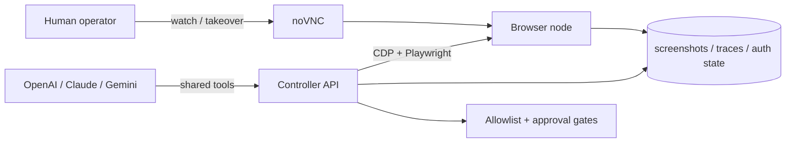

# Browser Operator POC

A visual browser-operator proof of concept for LLM-driven workflows.

This scaffold gives you:
- a **browser node** with Chromium, Xvfb, x11vnc, and noVNC
- a **controller API** built on FastAPI + Playwright
- **screen-aware observations** with screenshots and interactable element IDs
- **human takeover** through noVNC
- **artifact capture** for screenshots, traces, and storage state
- **basic policy rails** with host allowlists and upload approval gates
- a browser-node generated **shared ws-endpoint file** so the controller can attach even when Chrome advertises `127.0.0.1` in CDP metadata

It is intentionally **not** a stealth or anti-bot system. It is for operator-assisted browser workflows on sites and accounts you are authorized to use.

## Architecture at a glance



See `docs/architecture.md` for the full design and `docs/llm-adapters.md` for the model-facing action loop.

## Quickstart

```bash
cd browser-operator-poc
cp .env.example .env
docker compose up --build
```

Open:
- API docs: `http://localhost:8000/docs`
- Visual takeover: `http://localhost:6080/vnc.html?autoconnect=true&resize=scale`

All published ports bind to `127.0.0.1` by default. For remote access, put the stack behind Tailscale or another authenticated tunnel and update `TAKEOVER_URL`.

If `8000`, `6080`, or `5900` are already taken on the host, override them inline:

```bash
API_PORT=8010 NOVNC_PORT=6081 VNC_PORT=5901 \
TAKEOVER_URL='http://127.0.0.1:6081/vnc.html?autoconnect=true&resize=scale' \
docker compose up --build
```

### Create a session

```bash
curl -s http://localhost:8000/sessions \
  -X POST \
  -H 'content-type: application/json' \
  -d '{"name":"demo","start_url":"https://example.com"}' | jq
```

### Observe the page

```bash
curl -s http://localhost:8000/sessions/<session-id>/observe | jq
```

The response includes:
- current URL and title
- a screenshot path and artifact URL
- interactable elements with observation-scoped `element_id` values
- recent console errors
- the noVNC takeover URL

### Click by `element_id`

```bash
curl -s http://localhost:8000/sessions/<session-id>/actions/click \
  -X POST \
  -H 'content-type: application/json' \
  -d '{"element_id":"op-abc123"}' | jq
```

### Type into an input

```bash
curl -s http://localhost:8000/sessions/<session-id>/actions/type \
  -X POST \
  -H 'content-type: application/json' \
  -d '{"selector":"input[name=q]","text":"playwright mcp","clear_first":true}' | jq
```

### Save auth state for later reuse

```bash
curl -s http://localhost:8000/sessions/<session-id>/storage-state \
  -X POST \
  -H 'content-type: application/json' \
  -d '{"path":"demo-auth.json"}' | jq
```

### Stage upload files

This POC expects upload files to be staged on disk first:

```bash
cp ~/Downloads/example.pdf data/uploads/
```

Then call the upload action with `approved=true`.

## Project layout

```text
browser-operator-poc/
├── browser-node/        # headed Chromium + noVNC image
├── controller/          # FastAPI + Playwright control plane
├── data/                # artifacts, uploads, auth state, profile data
├── docker-compose.yml
└── docs/
    ├── architecture.md
    └── llm-adapters.md
```

## Opinionated defaults

- Keep **Playwright** as the execution engine.
- Use **screenshots + DOM/interactable metadata** together.
- Use **noVNC/xpra-style takeover** when a flow gets brittle.
- Use **one session per account/workflow**.
- Never automate with your daily browser profile.
- Keep **one active session per browser node** in this POC because takeover is tied to one visible desktop.

## Production upgrades after the POC

- replace raw local ports with **Tailscale** or Cloudflare Access
- move session metadata into Redis/Postgres
- run **one browser pod per account**
- switch from CDP to **Playwright `launchServer` / `connect`** for higher fidelity
- add policy enforcement for posting, payments, and sensitive domains
- add a real approval queue with human sign-off

## References

- OpenAI Computer Use: `https://developers.openai.com/api/docs/guides/tools-computer-use/`
- Playwright Trace Viewer: `https://playwright.dev/docs/trace-viewer`
- Playwright BrowserType `connectOverCDP`: `https://playwright.dev/docs/api/class-browsertype`
- Chrome remote debugging changes: `https://developer.chrome.com/blog/remote-debugging-port`
- Chrome for Testing: `https://developer.chrome.com/blog/chrome-for-testing`
- noVNC embedding: `https://novnc.com/noVNC/docs/EMBEDDING.html`
