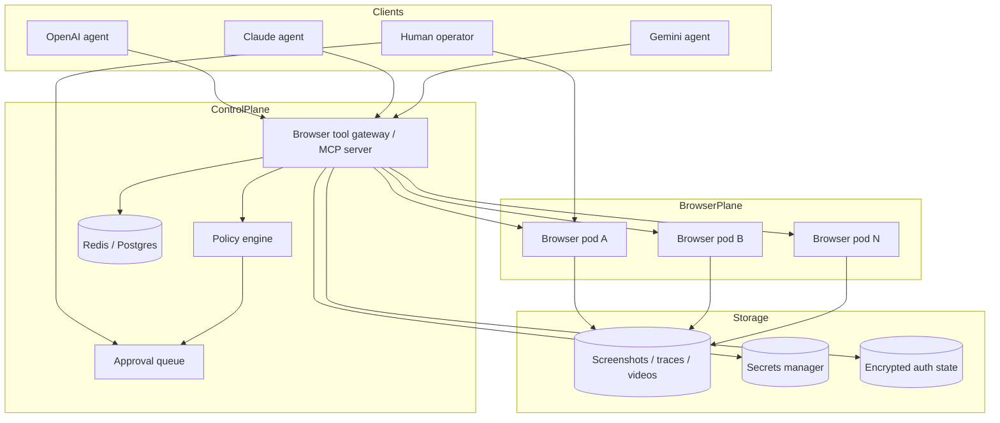

# Browser Operator Architecture

## Goal

Give multiple LLMs a shared, screen-aware browser harness that can:
- see the current browser viewport
- understand what is clickable or typeable
- execute actions through a stable API
- hand control to a human when needed
- keep an audit trail of what happened

## Non-goals

- bot evasion or anti-bot bypass
- CAPTCHA solving
- stealth fingerprints or deceptive identity shaping
- using real personal browser profiles

## The core idea

Split the system into **three planes** instead of forcing one tool to do everything.

### 1. Visual plane
What the model sees:
- viewport screenshot
- recent before/after screenshots around actions
- live takeover view through noVNC

### 2. Structured plane
What the model reasons over:
- URL and title
- interactable elements with stable `element_id`
- selector hints and bounding boxes
- console and page errors
- optional accessibility snapshots in a later iteration

### 3. Action plane
What actually touches the browser:
- Playwright actions
- policy checks before risky actions
- trace capture and action logs
- auth-state save/restore

## Why this shape is better than “just Playwright”

Raw Playwright is a strong executor, but by itself it does not define:
- how multiple LLMs share the same browser tool surface
- how screenshots and action history are fed back in a consistent way
- how humans take over visually mid-flow
- how you gate risky actions and preserve artifacts

This scaffold makes Playwright the execution engine and wraps it in an operator system.

## Recommended production architecture

## Session model

One session should own:
- one browser context
- one primary page
- one artifact directory
- one optional auth-state file
- one lock so actions happen in order

Why:
- per-session isolation is easier to reason about
- auth state stays scoped to a single workflow or account
- replaying artifacts is simple

### POC constraint

This scaffold intentionally limits the node to **one active session**. The browser node exposes one X display and one noVNC surface, so human takeover is global to that desktop. In production, move to one browser node per session or per account.

## Browser node

The browser node in this POC is a single container with:
- Chromium
- Xvfb
- Fluxbox
- x11vnc
- noVNC
- remote debugging exposed on port `9222`

This is the visual execution box.

### Why not Brave

Brave adds extra variability and browser-specific behavior without helping the controller model. For automation and reproducibility, use **Chromium or Chrome for Testing**.

### Chrome security note

Chrome tightened remote debugging behavior in **March 2025**. Using `--remote-debugging-port` against a normal default profile is no longer the right pattern. Use a dedicated `--user-data-dir`, or better, Chrome for Testing. This POC launches Chromium with a dedicated profile path for that reason.

## Controller

The controller owns:
- session creation and teardown
- host allowlist checks before navigation
- action execution via Playwright
- screenshot capture and artifact storage
- interactable extraction and stable element IDs
- auth-state save/restore
- trace export on close

### Why the controller should be the only thing LLMs talk to

Because you want one stable contract:
- `create_session`
- `observe`
- `click`
- `type`
- `scroll`
- `upload`
- `save_storage_state`
- `request_human_takeover`
- `close_session`

That lets you swap models without rewriting browser logic.

## Policy rails

This POC includes two basic rails:
- **host allowlist** for navigation
- **explicit upload approval** for file uploads

Production should add more:
- domain classes: read-only vs write-capable
- action classes: navigation vs upload vs publish vs purchase
- human approval for posting, payments, and account changes
- per-model scopes and quotas

## Human takeover

noVNC is the recovery path.

Use it when:
- login is brittle
- MFA is required
- the model is uncertain
- a site changes its UI
- you want to supervise before a sensitive step

The point is not to fully remove humans. The point is to **keep workflows moving** when automation hits edge cases.

## Why screenshots plus interactable IDs matter

Screenshot-only control makes models guess. DOM-only control makes them blind.

The better loop is:
1. capture a screenshot
2. tag and extract interactables
3. let the model choose an `element_id` or selector
4. execute the action
5. capture the after-state
6. verify what changed

That is the minimal reliable operator loop.

## Production roadmap

### Phase 1 — current POC
- single browser node
- single controller
- noVNC takeover
- in-memory session registry
- local artifact volume

### Phase 2 — private remote access
- put the stack behind Tailscale or Cloudflare Access
- add TLS and auth at the gateway
- remove public raw debugging ports

### Phase 3 — multi-session isolation
- one container or VM per account
- Redis / Postgres for session registry
- queue-backed task execution
- per-session CPU/memory quotas

### Phase 4 — better model ergonomics
- browser tool gateway as MCP server
- built-in retry semantics
- action verification policies
- optional OCR / accessibility snapshots
- route selection between DOM-click and coordinate-click

### Phase 5 — enterprise hardening
- encrypted auth-state storage
- action approval workflows
- audit log export
- secret rotation
- SSO and operator identity

## Operational advice

- prefer APIs over browser automation when an official API exists
- keep real-world side effects behind approval gates
- never share one browser profile across multiple identities
- store screenshots, traces, and action logs by session ID
- make every action replayable
